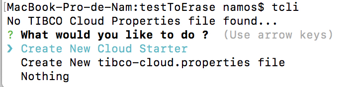

## Getting Started

You will find here a series of tutorials to help you get started and some more advanced subjects.

First of all, we want to get you started and get your environment ready with your own version of the Form Template.


This app can be used to create a seperate Angular Elements Application to add custom form applications to a Cloud Starter.

### Installation prerequisites

You have to follow the instruction to setup TCLI command that you can find here : TODO add link to TCLI

### 1.) Generate your app

   Build a new cloud starter application using a Pattern App Template
  
   Go to an empty folder and run the tcli command
   
   
   
   Choose the option "Create new Cloud Starter"
   
  Then fill the name (MyFormTemplate for example) and from the list of Pattern App, you choose "Form Template"
   
    
  
  Application is generated in the MyFormTemplate folder created in the folder you are actually in

  You can now open the Application Code in your favorite Angular editor (we internally use Webstorm for example)


#### 2.) Start App
  
  To locally start your app, just do
  
  ```
  tcli start
  ```
  
  Your app will start and will be able to browse your app : http://localhost:4200
  
  
  

  
#### 3.) Create a form component

  Generate a component 
  
  ```
  tcli schematic-add
  ```

  Choose from the list the option :
 
 - custom-form-creator : if you want to create a form for a LA Creator
 - custom-form-action : if you want to create a form for a LA Action
 - custom-form-casedata : if you want to create a form to display the case data
 
 TODO exlplain the formID with screenshots
 
 
 This will create a new component with the given name in the folder : 
 
 ```
 /src/app/custom-forms/
 ```
    
    
#### 4.) Implement your form

TODO EXPLAIN


#### 5.) Create Web Components js (form-package.js):

  To create an Angular Element from your project, run the following command

```
 npm run build:elements
```

  This will create 2 files : 
  
  - assets/form-package.js : the Angular Element for your forms
  - assets/styles.css : the css that goes with your Angular Element
  
  

  
#### 6.) Configure your Cloud starter to use that Angular Element

  - Copy the 2 files previously created to the "assets" folder of your Cloud Starter
  
  - Import that package in the index.html by adding
  ```
  <script src="assets/form-package.js"></script> 
``` 

  - Edit the Cloud Starter Toolkit Applications's customForms.json to include the new form references 
  
  TODo explain and sceenshot

  
 
